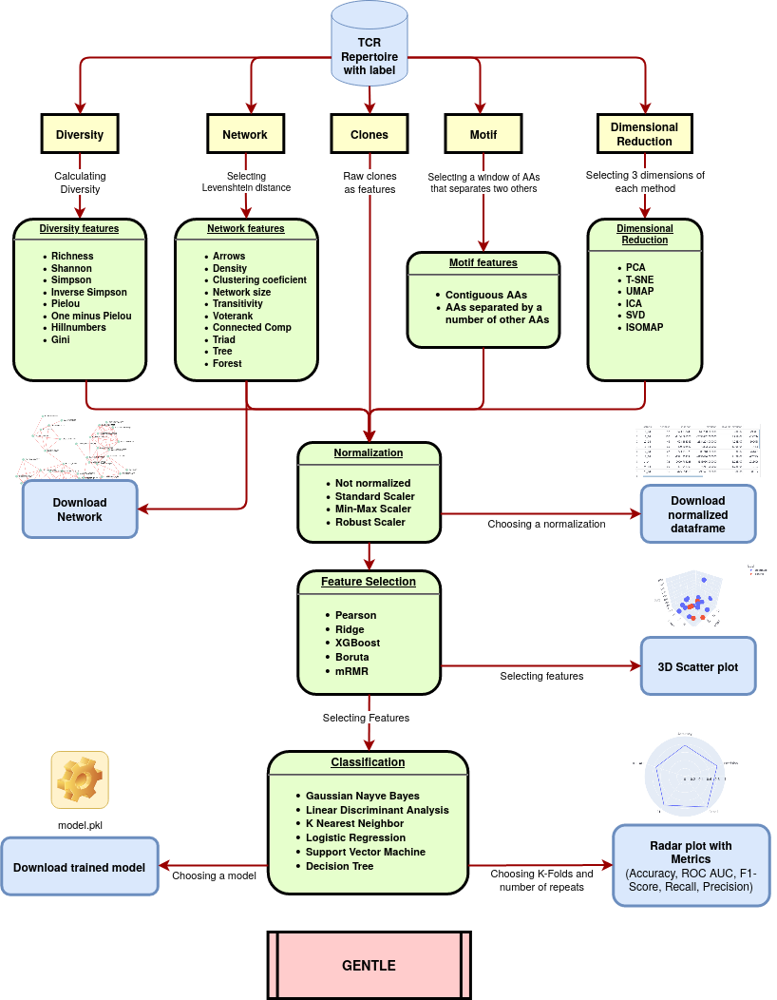

GENTLE is a user friendly Streamlit application that can generate features from TCR repertoire data, use feature selection algorithms to identify features with high predictive power and also create fast machine learning models. Gentle also allows you to download dataframes, networks and classifier models for further analyses.

The GENTLE web application can be accessed on https://share.streamlit.io/dhiego22/gentle/main/gentle.py

## Running with Virtualenv

Inside the main folder, type the following commands:
 
  `pip install virtualenv`
  
  `virtualenv -p python3 venv_python3`
  
  `source venv_python3/bin/activate`
  
  `pip install -U -r requirements.txt`
  
  `streamlit run gentle`
  
  Then, open a web browser and type `localhost:8501`
   
## Running with Docker

Install Docker engine and Docker compose. Inside the main folder, type:

  `docker-compose up`
  
Then, open a web browser and type `localhost:8501`

## Quick guide

1. Upload a dataframe where the columns should be the TCR sequences and the rows should be the samples. The file should be in csv format or if it is too big, you can zip it. Observation: you must clear the cache (press 'c' or on the top-right options) when you upload a new dataframe.
2. Choose the feature that you want to analyse at the sidebar. 
3. Choose the normalization method to be used (optional).
4. Check the box at the sidebar to start feature selection process.
5. Choose the features selected by the feature selection methods for analyses. You can sort a column by clicking on it, once for ascending order, twice for descending order. If you choose two features, a 2D scatter plot will appear. If you choose three features, a 3D scatter plot will appear. 
6. Check the box to train the model with four classification methods. A radar plot with five scoring methods will appear for each classifier. You can download the created model as a pkl format.
7. Upload a second dataframe to validade the created model. A radar plot with the scoring methods will appear along with a confusion matrix. 

## Flowchart

  
## Bug report

- Please report bugs to dhiego@systemsbiomed.org

